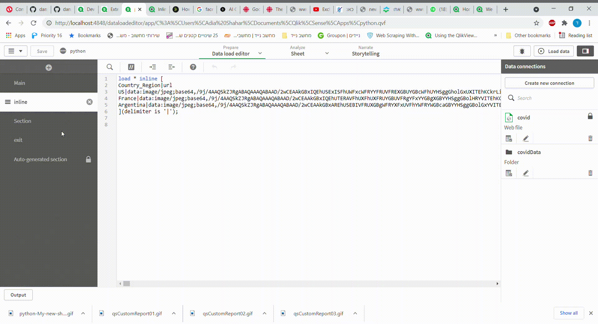
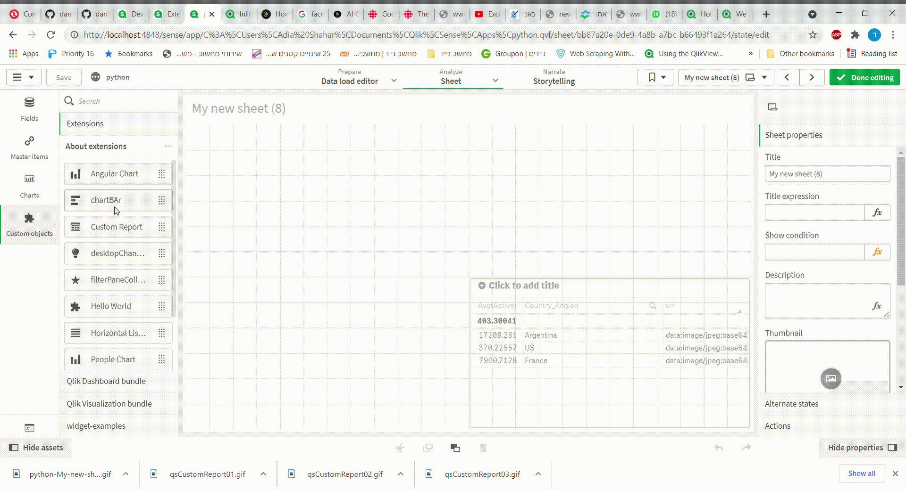

# chartBarIcon

i have created a bar chart that can show icon or any inmage you will like

**setup load script**
you need to load data with a url address to the images you need  and for example here is load inline script

**just drag and drop and add the url dimension **

