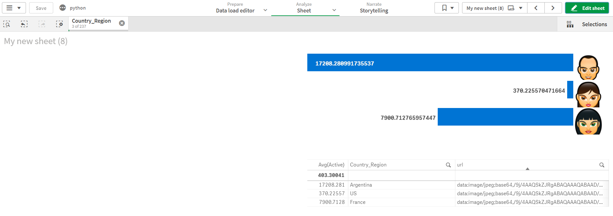

# chartBarIcon

i have created a bar chart that can show icon or any image you will like

**setup load script** 
load url address data to the images you need    for example here is load inline script

**just drag and drop and add the url dimension **

